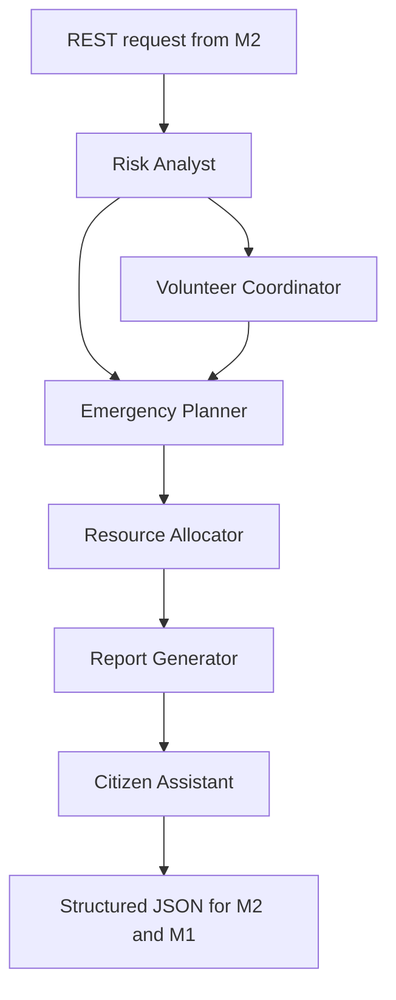
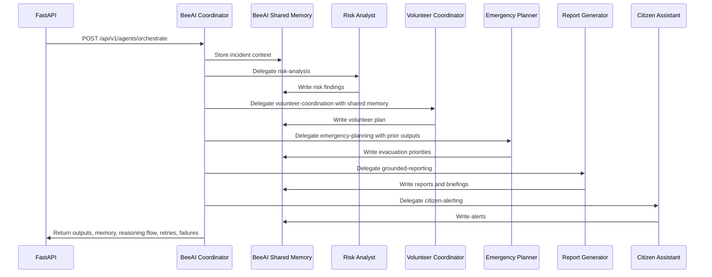

# BeeAI Multi-Agent System

This service uses the real BeeAI Framework Python SDK.

## Why AgentWorkflow

`AgentWorkflow` is the simplest production-ready BeeAI orchestration pattern for this hackathon because it provides:

- role-specialized agents
- shared workflow context
- typed workflow inputs
- native BeeAI orchestration
- fewer dependencies than custom handoff trees
- clean REST integration for M2 and visualization output for M1

## Agents

| Agent | Role | Goal | Memory | Tools | Output |
| --- | --- | --- | --- | --- | --- |
| Risk Analyst | Analyzes flood, fire, infrastructure, and evacuation risk signals. | Identify urgent risks, confidence, and feature drivers. | BeeAI workflow context and incident memory. | `risk_scoring_tool`, `rag_retrieval_tool` | Risk summary with drivers and uncertainty. |
| Volunteer Coordinator | Maps needs to volunteer and NGO operations. | Prioritize volunteer actions and coordination gaps. | Shared context and prior specialist outputs. | `rag_retrieval_tool`, `grounded_granite_tool` | Volunteer tasking plan. |
| Emergency Planner | Plans evacuation, access, shelter routing, and sequencing. | Convert risk and road findings into safe movement priorities. | Shared context plus risk and volunteer outputs. | `graph_analysis_tool`, `rag_retrieval_tool` | Evacuation and response plan. |
| Resource Allocator | Allocates medical teams, food, water, rescue teams, and shelters. | Assign scarce resources using risk, distance, availability, and priority. | Shared context plus risk, volunteer, and planning outputs. | `resource_allocation_tool`, `rag_retrieval_tool` | Explainable resource allocation plan. |
| Report Generator | Creates formal grounded outputs. | Generate reports and briefings only through RAG-grounded Granite. | Full prior workflow context. | `grounded_granite_tool`, `rag_retrieval_tool` | Incident report, NGO plan, authority briefing. |
| Citizen Assistant | Creates citizen-safe alert language. | Produce concise multilingual alerts from grounded guidance. | Shared context plus reporting output. | `grounded_granite_tool`, `rag_retrieval_tool` | Public alert messages. |

## Orchestration Flow

## Communication Flow

## Retry And Failure Handling

- Each orchestration request supports `max_retries`.
- The coordinator records every attempt in `reasoning_flow`.
- Failed attempts are written into shared memory before retry.
- Retryable failures are returned in `failures` with `retryable=true`.
- Final failure returns structured JSON with failed agent outputs instead of a broken response.

## Response Fields For Visualization

- `task_delegations`: coordinator-to-agent task handoffs
- `shared_memory`: incident context and agent outputs
- `reasoning_flow`: observable BeeAI workflow events
- `agent_results`: final per-agent outputs
- `failures`: retry and error records

## REST API

- `GET /api/v1/agents/definitions`
- `POST /api/v1/agents/orchestrate`

## Grounding Rule

Any generated reports or alerts must use `grounded_granite_tool`, which calls the Granite service that blocks generation unless RAG retrieval returns grounding contexts.
