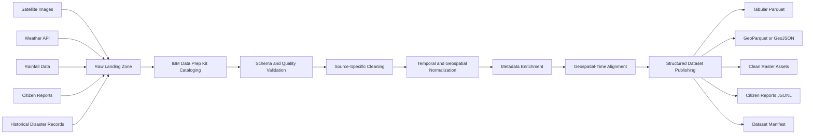

# AI Data Preprocessing Pipeline

This document defines the M3 data pipeline for producing a clean structured dataset from raw disaster-preparedness inputs.

No ML, model inference, risk scoring, or prediction is included in this stage.

## Inputs

- Satellite images
- Weather API responses
- Rainfall datasets
- Citizen reports
- Historical disaster records

## Output

A clean structured dataset partitioned by geography and time, ready for later CV, graph, RAG, and risk-engine modules.

Recommended output format:

- `Parquet` for tabular structured datasets
- `GeoParquet` or `GeoJSON` for geospatial features
- `Cloud Optimized GeoTIFF` for cleaned raster imagery
- `JSONL` for normalized citizen-report text records
- Dataset manifest as `manifest.json`

## IBM Data Prep Kit Role

IBM Data Prep Kit is the orchestration and transformation layer for:

- Dataset ingestion
- Metadata extraction
- Schema normalization
- Deduplication
- Data validation
- PII redaction for citizen reports
- File format conversion
- Partitioning
- Dataset manifest creation
- Lineage tracking

## Pipeline Overview



## Processing Stages

### 1. Raw Landing

Store source files exactly as received.

Expected folders:

- `data/raw/satellite`
- `data/raw/weather`
- `data/raw/rainfall`
- `data/raw/citizen_reports`
- `data/raw/historical_disasters`

Metadata captured:

- `source_name`
- `source_type`
- `ingested_at`
- `original_file_name`
- `checksum`
- `license`
- `collection_window_start`
- `collection_window_end`

### 2. Cataloging With IBM Data Prep Kit

Data Prep Kit catalogs every input artifact before transformation.

Catalog fields:

- `dataset_id`
- `record_count`
- `file_count`
- `format`
- `schema_version`
- `spatial_coverage`
- `temporal_coverage`
- `quality_status`
- `lineage_parent_ids`

### 3. Source-Specific Preprocessing

#### Satellite Images

Purpose: prepare imagery for later CV without running CV.

Steps:

- Validate raster readability with Rasterio
- Extract CRS, bounds, resolution, band count, and acquisition timestamp
- Reproject to the project CRS
- Tile large rasters into consistent spatial windows
- Normalize filenames and tile identifiers
- Generate raster metadata table
- Store cleaned raster assets

Outputs:

- `data/processed/satellite/tiles`
- `data/processed/satellite/raster_metadata.parquet`

#### Weather API

Purpose: convert API payloads into consistent time-series features.

Steps:

- Flatten nested API responses
- Normalize timestamps to UTC
- Standardize units
- Validate required weather fields
- Attach weather-station or grid-cell geometry
- Remove duplicate observations

Outputs:

- `data/processed/weather/weather_observations.parquet`

#### Rainfall Data

Purpose: align rainfall observations with geography and time windows.

Steps:

- Parse CSV, JSON, NetCDF, or raster rainfall inputs
- Standardize rainfall units to millimeters
- Normalize timestamps to UTC
- Aggregate rainfall into configured windows
- Attach station, ward, settlement, or grid-cell geometry
- Flag missing or anomalous values

Outputs:

- `data/processed/rainfall/rainfall_observations.parquet`

#### Citizen Reports

Purpose: clean human-submitted reports for structured analysis and later RAG.

Steps:

- Normalize report channels
- Validate location fields
- Geocode or attach known settlement identifiers when available
- Redact personally identifiable information
- Normalize severity labels without predicting severity
- Preserve cleaned text
- Track language and source confidence metadata

Outputs:

- `data/processed/citizen_reports/citizen_reports.jsonl`
- `data/processed/citizen_reports/citizen_reports.parquet`

#### Historical Disaster Records

Purpose: create a standardized disaster-event reference table.

Steps:

- Normalize disaster categories
- Normalize date ranges
- Validate location geometry
- Standardize impact fields
- Deduplicate repeated event records
- Attach source and confidence metadata

Outputs:

- `data/processed/historical_disasters/disaster_events.parquet`

### 4. Temporal Normalization

All records use:

- `event_time_utc`
- `observed_start_utc`
- `observed_end_utc`
- `ingested_at_utc`
- `time_bucket`

Recommended demo buckets:

- `1h`
- `6h`
- `24h`

### 5. Geospatial Normalization

All geospatial records use:

- A common project CRS
- `geometry`
- `latitude`
- `longitude`
- `admin_area_id`
- `settlement_id`
- `grid_cell_id`

Recommended spatial joins:

- Raster tile to grid cell
- Weather point to nearest grid cell
- Rainfall point or raster cell to grid cell
- Citizen report to settlement and grid cell
- Disaster event geometry to impacted grid cells

### 6. Quality Gates

Each dataset must pass basic quality gates before publishing.

Checks:

- Required columns exist
- Timestamps are parseable
- Coordinates are valid
- Geometries are valid
- Units are standardized
- Duplicate records are removed or flagged
- PII is redacted from citizen reports
- Source lineage is preserved

### 7. Structured Dataset Publishing

Final published dataset layout:

```text
data/processed/structured_dataset/
  manifest.json
  grid_cells.geoparquet
  satellite_tiles.parquet
  weather_observations.parquet
  rainfall_observations.parquet
  citizen_reports.parquet
  citizen_reports.jsonl
  historical_disaster_events.parquet
  aligned_observations.parquet
```

## Clean Dataset Contract

### `grid_cells`

- `grid_cell_id`
- `geometry`
- `centroid_latitude`
- `centroid_longitude`
- `admin_area_id`
- `settlement_id`
- `area_sq_m`

### `satellite_tiles`

- `tile_id`
- `grid_cell_id`
- `raster_path`
- `acquired_at_utc`
- `crs`
- `resolution_m`
- `band_count`
- `bounds`
- `source_name`
- `quality_status`

### `weather_observations`

- `weather_observation_id`
- `grid_cell_id`
- `observed_at_utc`
- `temperature_c`
- `humidity_percent`
- `wind_speed_mps`
- `pressure_hpa`
- `source_name`
- `quality_status`

### `rainfall_observations`

- `rainfall_observation_id`
- `grid_cell_id`
- `observed_start_utc`
- `observed_end_utc`
- `rainfall_mm`
- `aggregation_window`
- `source_name`
- `quality_status`

### `citizen_reports`

- `report_id`
- `grid_cell_id`
- `settlement_id`
- `reported_at_utc`
- `report_channel`
- `report_category`
- `normalized_severity_label`
- `clean_text`
- `language`
- `pii_redaction_status`
- `source_confidence`

### `historical_disaster_events`

- `event_id`
- `grid_cell_id`
- `event_type`
- `event_start_utc`
- `event_end_utc`
- `impact_summary`
- `fatalities`
- `injuries`
- `displaced_people`
- `property_damage_estimate`
- `source_name`
- `source_confidence`

### `aligned_observations`

This table is the main handoff for later non-preprocessing modules.

- `grid_cell_id`
- `time_bucket`
- `satellite_tile_ids`
- `weather_observation_ids`
- `rainfall_observation_ids`
- `citizen_report_ids`
- `historical_event_ids`
- `data_completeness_score`
- `quality_status`

## Module Boundaries

- Ingestion adapters collect and stage raw data.
- Data Prep Kit transforms and validates source datasets.
- Geospatial processors normalize CRS, geometry, and grid alignment.
- Dataset publishers write clean outputs and manifests.
- ML modules consume the published dataset later.

No ML belongs in this pipeline.
