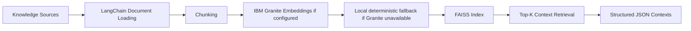

# Retrieval-Only RAG Pipeline

This pipeline prepares and retrieves disaster-response knowledge contexts only.

No report generation, summarization, recommendations, or Granite completions are performed here.

## Knowledge Sources

- Government SOPs
- Disaster guidelines
- NGO manuals
- Historical disaster reports
- Municipal documents

## Flow



## Endpoints

- `POST /api/v1/rag/index`
- `POST /api/v1/rag/retrieve`

## Source Folder Convention

```text
data/reference/
  government_sops/
  disaster_guidelines/
  ngo_manuals/
  historical_disaster_reports/
  municipal_documents/
```

Supported local file formats:

- `.txt`
- `.md`
- `.json`
- `.jsonl`
- `.csv`

## Retrieval Output

Each returned context includes:

- `chunk_id`
- `document_id`
- `source_type`
- `title`
- `text`
- `score`
- `source_uri`
- `metadata`
